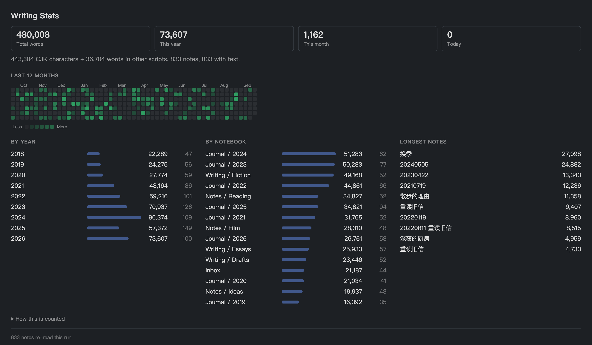

# Recall — a Joplin plugin

Rediscover your own notes, and see how much you've actually written.

- **Open a random note** — one click (or toolbar button) jumps you to a random
  note. Great for serendipitous review.
- **On This Day** — surfaces notes you created on *this calendar day in previous
  years*, the way photo apps show "memories". Joplin has no built-in equivalent.
- **Daily Recall digest** — generates a single note combining *On This Day* plus
  a handful of random notes, with clickable links. Optionally built automatically
  on startup.
- **Writing statistics** — the word count of your whole library: totals, a
  12-month heatmap, and breakdowns by year and by notebook.

## Writing statistics



<sub>Screenshot generated from a synthetic library (`node tools/demoData.js`), not
from anyone's real notes.</sub>

Every other Joplin word-count plugin counts the *current* note, and all of them
tokenise with `/\b\w+\b/`, where `\w` is ASCII-only. A 500-character Chinese
note reports **0 words**. Recall counts the whole library, and counts CJK
correctly:

| Text | `/\b\w+\b/` | Recall |
| --- | ---: | ---: |
| `今天下午去看了房子，中介说学区还不错。` | 0 | 17 |
| `读完这本书花了三天，里面讲的 survivorship bias 很有意思。` | 2 | 19 |
| `これはテストです` | 0 | 8 |
| `Today I went to see the apartment.` | 7 | 7 |

**How it counts.** Han characters, hiragana and katakana count per character —
the convention in Chinese and Japanese publishing. Every other script,
including Hangul and Cyrillic, counts per word. Before counting, markdown
syntax, URLs, attachment links, HTML tags and inline code are stripped, and
fenced code blocks are excluded entirely and reported separately. Full-width
punctuation is reported on its own line rather than folded into the total.
Recall's own generated notes are never counted.

**Performance.** Counts are cached per note and only recomputed when a note's
`updated_time` changes. On a 3,400-note library the first run reads every body
in ~70 paged API calls; later runs re-read nothing and only refresh the
metadata. The cache lives in a plugin setting (~220 KB at that size) and can be
rebuilt from the panel.

**Where it lives.** Open it from **Tools → Recall → Writing statistics**. It is
a dialog, not a panel, because this is a look-at-it-occasionally feature and a
panel would hold a column of the layout open for it permanently. From the
dialog you can copy the figures as Markdown or rebuild the cache.

## Usage

After installing, you get:

- A **die icon** in the note toolbar → open a random note.
- A **Tools → Recall** menu with every action.

## Settings

Settings → Recall:

| Setting | Default | What it does |
| --- | --- | --- |
| Random notes in Daily Recall | 3 | How many random notes the digest includes |
| Exclude completed to-dos | on | Skip finished to-dos when picking notes |
| Target notebook ID | _(empty)_ | Where generated notes are stored; empty = default |
| Generate Daily Recall on startup | off | Auto-build the digest when Joplin starts |

The "On This Day" and "Daily Recall" notes are **upserted per day** —
re-running updates the same note instead of creating duplicates.

## Building from source

```bash
npm install
npm test            # counting assertions, including the CJK cases above
npm run dist        # produces publish/com.github.smieltalker.recall.jpl
```

Install the resulting `.jpl` via Joplin → Settings → Plugins → gear icon →
*Install from file*.

### Checking the counter against your own library

`tools/` holds two harnesses that run the real code against a real library with
the plugin API stubbed out (`tools/apiStub.ts`), so you can check both the
numbers and the layout without launching Joplin:

```bash
npm run harness

# numbers: totals, per-year and per-notebook breakdowns, cache behaviour
<dump> | node .harness-build/tools/statsHarness.js

# layout: renders the dialog to a standalone HTML file
# (a 5th argument of "light" or "dark" picks one theme; omit it for both)
<dump> | node .harness-build/tools/previewHarness.js out.html \
          src/webview/stats.css src/webview/stats.js
```

`<dump>` can be `node tools/demoData.js`, which emits a deterministic synthetic
library — that is how the screenshot above is produced, so no real notes are
involved:

```bash
node tools/demoData.js | node .harness-build/tools/previewHarness.js \
  docs/preview.html src/webview/stats.css src/webview/stats.js dark
```

To check it against your own library instead, pipe NDJSON on stdin out of a
read-only query against `database.sqlite` — one
`{"t":"n","v":{...note fields...}}` line per note and one
`{"t":"f","v":{...folder fields...}}` per notebook. Piping rather than dumping
to a file keeps your notes off disk.

## License

MIT
